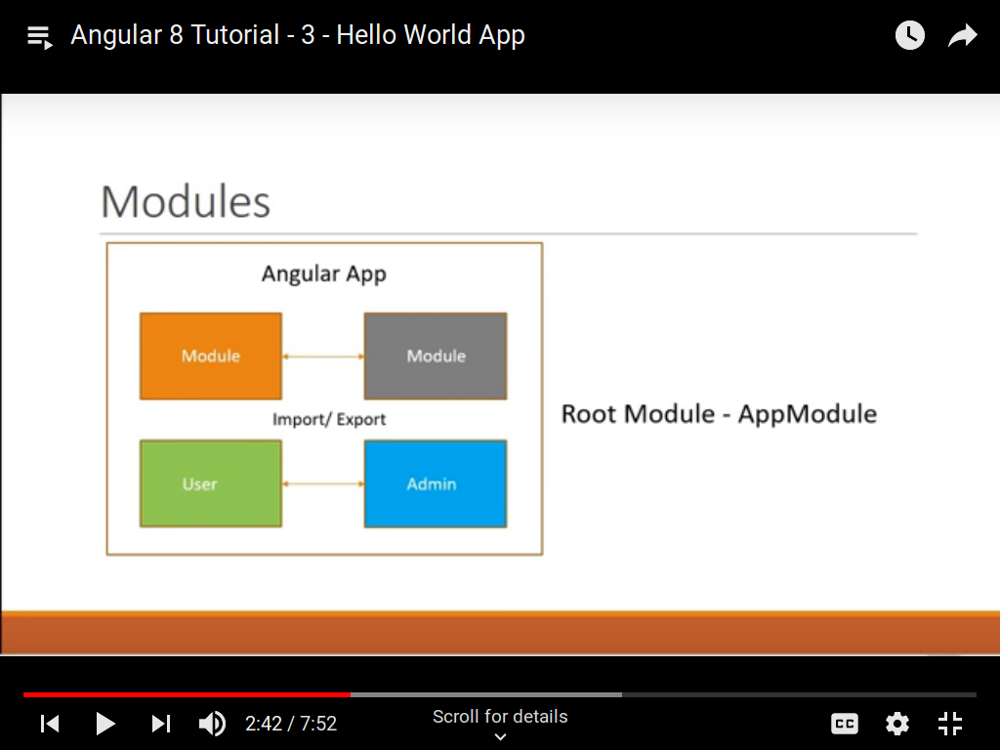
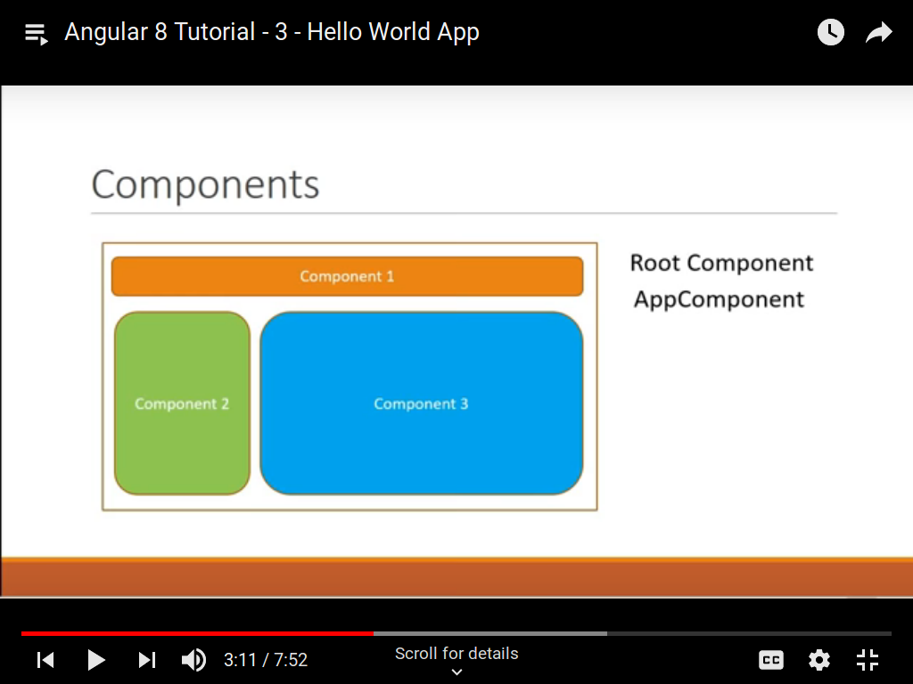
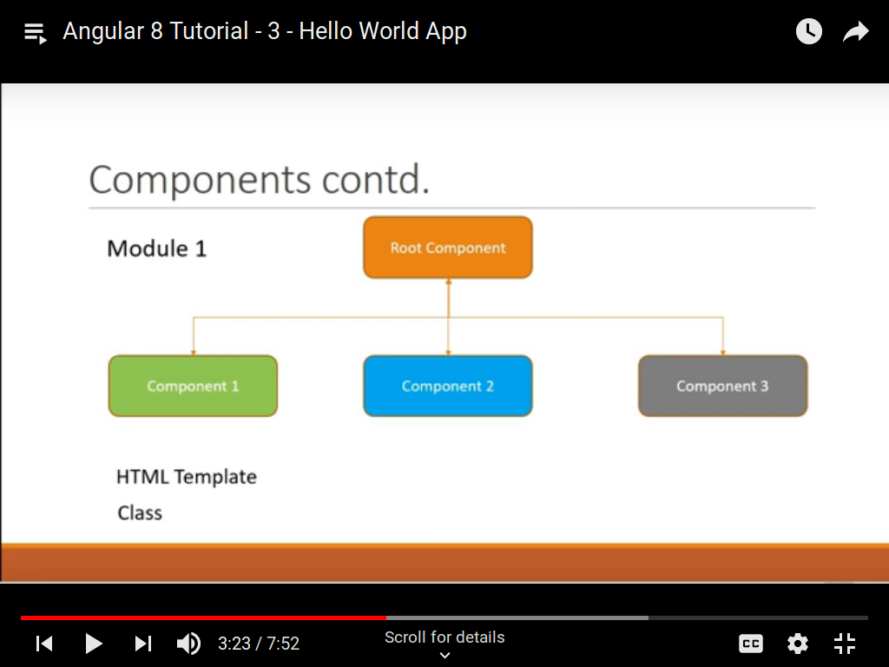
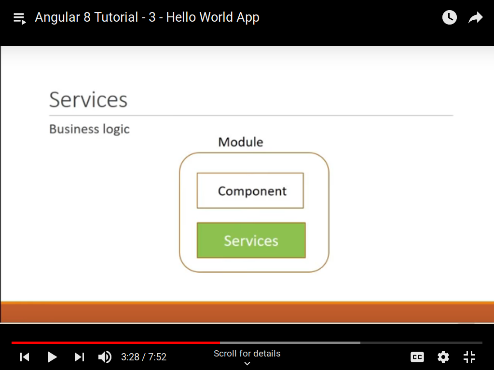

####To create a new project:

    $ ng new <project-name>

Now, cd to the project folder.

    $ cd <project-name>

To start the application

    $ ng serve

Architecture of Angular
-----------------------

####Module

The first building block is a module. An Angular application is a collection of many individual module. Every module
represents a feature area in your application. Every Angular application has atleast one module, the root module.

####Components

Each module is in turn made of components and services. A component controls a portion of the view on the browser.

Every Angular application has at least one component, the root component.

All other components will be bested inside this root component.

####Services

Modules will also have services, which is basically a class that contains the business logic of your application.

Architecture Summary
--------------------

####Angular app - one or more modules
####Module - One or more components and services.
####Components - HTML + Class
####Services - business Logic
####Modules interact and ultimately render the view in the browser.

package.json
------------

Contains the dependencies and dev dependencies that are required for your Angular application to work.

Yo can also run the application in browser using

    $ npm start # which will internally call the ng serve command.
